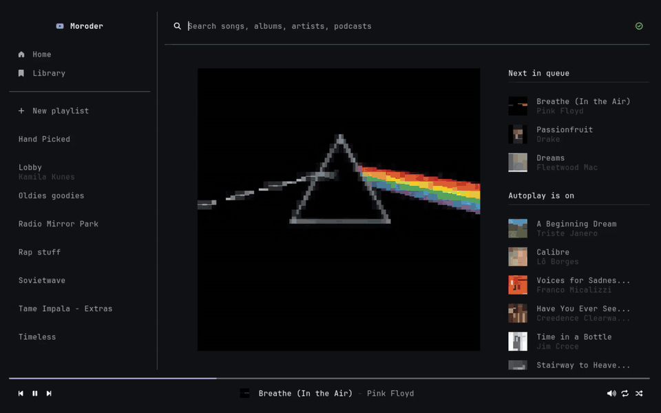

# Moroder

Album art, radio, your library, MPRIS, and Discord rich presence - in a TUI.

<p align="center">
  
</p>

</div>

---

## Contents

- [What it is](#what-it-is)
- [Requirements](#requirements)
- [Installation](#installation)
- [Building](#building)
- [Getting started](#getting-started)
- [Signing in](#signing-in)
- [Using it](#using-it)
- [Configuration](#configuration)
- [Keybinds](#keybinds)
- [Integrations](#integrations)
- [Architecture](#architecture)
- [Talking to YouTube Music](#talking-to-youtube-music)
- [Logging](#logging)
- [Troubleshooting](#troubleshooting)
- [Limitations](#limitations)

---

## What it is

Moroder is a terminal client for YouTube Music, written in C++17. It plays your
library, runs radios, searches, and renders album art as character art directly
in the terminal.

It talks to YouTube Music's internal InnerTube API through its own C++
implementation - Audio goes through libmpv, which shells out to `yt-dlp` to resolve
streams.

**Features**

- Home page built from your account's shelves, in an order you control
- Library browsing with filter chips for albums, playlists, songs, artists and podcasts
- Search across songs, albums, artists, playlists and podcasts
- Radio and autoplay, with continuations fetched ahead of the queue
- A queue you can add to, skip through and remove from
- Looping, over the queue or the current track
- Album covers rendered as character art
- Full MPRIS support, so `playerctl` and desktop widgets control it
- Discord rich presence, with a configurable headline field
- Runs signed-in or anonymously

---

## Requirements

### Build

| Dependency | Purpose |
|---|---|
| C++17 compiler | GCC or Clang |
| [FTXUI](https://github.com/ArthurSonzogni/FTXUI) | terminal UI |
| `ftxui-grid-container` | grid layout for the library and Quick Picks |
| libmpv | playback |
| libcurl | HTTP |
| [nlohmann/json](https://github.com/nlohmann/json) | JSON |
| [spdlog](https://github.com/gabime/spdlog) | logging |
| [sdbus-c++](https://github.com/Kistler-Group/sdbus-cpp) | MPRIS over D-Bus |
| Discord Social SDK (`discordpp`) | rich presence |

### Runtime

| Program | Purpose | Required |
|---|---|---|
| `mpv` | plays the audio | yes |
| `yt-dlp` | resolves YouTube streams, mpv calls it internally | yes |
| `xdg-open` | opens the browser during setup | optional |

`moroder setup` checks for these and tells you what is missing.

> **Note**
> Moroder is Linux-only. MPRIS over sdbus-c++, the XDG config paths and the
> browser profile discovery all assume it.

---

## Installation

### Arch Linux

Moroder is available as a prebuilt package for Arch Linux via the AUR:

```bash
yay -S moroder-bin
```


If you want to build Moroder from source, see [Building](#building).

---

## Building

Building from source requires the [Discord Social SDK](https://docs.discord.com/developers/discord-social-sdk/getting-started/using-c++) to be placed at:

```text
./lib/discord_social_sdk/
```

The SDK is not included in this repository.

The expected directory structure is:

```text
./lib/
└── discord_social_sdk/
    ├── include/
    │   ├── cdiscord.h
    │   └── discordpp.h
    └── lib/
        ├── debug/
        └── release/
```

Without the Discord Social SDK in `./lib/`, **building from source is not possible**.

If you do not have the SDK, **prebuilt binaries are available from the GitHub Releases**.

Once the SDK is in place, build Moroder after cloning the repository with:

```bash
cmake -B build -S . -DCMAKE_BUILD_TYPE=Release && cmake --build build --parallel
```

The default config is embedded into the binary at build time: `moroder.conf` is compiled into `build/gen/defaults.hpp` as a byte array, which is what `config.hpp` writes out on first run. If you edit the default config, the header will be automatically regenerated.

### Arch Linux

Install the required build dependencies with:

```bash
sudo pacman -S --needed base-devel cmake mpv curl yt-dlp
```

### Debian Linux

Moroder depends on:

* `libmpv-dev` or `mpv`
* `libcurl-dev` (virtual package; see the Linux Mint instructions below)
* `cmake`
* `yt-dlp` **(latest version required)**
* `sdbus-c++`
* `libsystemd-dev`
* `pkg-config`

#### Linux Mint

On Linux Mint, install the required development libraries and build dependencies with:

```bash
sudo apt update
sudo apt install cmake mpv libmpv-dev libcurl4-openssl-dev libsystemd-dev pkg-config
```

Moroder also requires **the latest version of `yt-dlp`**. The version available in Linux Mint's repositories may be outdated, so install or upgrade `yt-dlp` using the official recommended installation method rather than relying on the Mint repository version.

You can verify your installed version with:

```bash
yt-dlp --version
```

> **Note:** `libcurl-dev` is a virtual package on Debian/Ubuntu-based distributions. On Linux Mint, `libcurl4-openssl-dev` provides the required `libcurl` development files.

After installing the dependencies, follow the standard CMake build instructions.

---

## Getting started

```bash
moroder setup     # sign in, once
moroder           # start the player
```

`setup` writes two files and never touches anything else:

```
~/.config/moroder/browser.json    your YouTube Music session   (cookies)
~/.config/moroder/moroder.conf    everything else
```

To run without an account:

```bash
moroder --anonymous     # or -a
```

### Commands

| Command | What it does |
|---|---|
| `moroder` | starts the player |
| `moroder setup` | signs in and fills in the config |
| `moroder --anonymous`, `-a` | starts without an account |
| `moroder --help`, `-h` | usage |

---

## Signing in

Moroder talks to YouTube Music the way your browser does, by reusing the
session your browser already holds. No password is involved and nothing is sent
anywhere except YouTube.

```bash
moroder setup
```

The command walks through five steps:

1. Checks that `mpv` and `yt-dlp` are installed
2. Opens `music.youtube.com` so you can confirm you are signed in
3. Looks for your browser profile, which is used for stream cookies
4. Takes the request headers you paste in and checks them against a live request
5. Writes `browser.json` and records `BROWSER` and the two paths in `moroder.conf`

Nothing is saved until step 4 passes. The new session is staged as
`browser.json.new` and only moved into place once YouTube Music has answered,
so a failed sign-in can never replace a working one. The previous session is
kept as `browser.json.bak`.

### Copying the headers

1. Open `music.youtube.com`, signed in
2. F12 → Network tab
3. Reload, filter requests for `/youtubei/`
4. Click any POST request
5. Copy everything under **Request Headers**, paste into the terminal, `Ctrl-D`

Both DevTools' "Copy All" (`name: value` lines) and "Copy as cURL"
(`-H 'name: value'`) are accepted.

> **Note**
> Earlier versions could also pull the cookie out of the browser store with
> yt-dlp. That path recovered the cookie alone - no `x-goog-visitor-id` and no
> real `user-agent` - so every start had to scrape a visitor id from the
> YouTube Music homepage, which made requests slower and easier to rate limit.
> Pasting is now the only method, and it captures all three.

### The browser profile

Separately from the session, setup looks for your browser's profile directory
and records it as `MPV_COOKIES_PATH`. That is what yt-dlp reads when opening a
stream, and it is what lets age-restricted and premium tracks play. It has
nothing to do with signing in, so if no profile is found, setup says so and
carries on.

```bash
moroder setup --browser librewolf
```

Supported: `firefox`, `librewolf`, `floorp`, `waterfox`, `zen`, `mercury`,
`icecat`, `tor`, `chrome`, `chromium`, `brave`, `edge`, `opera`, `vivaldi`,
`whale`.

yt-dlp only knows a fixed list of browser names, so the Firefox forks are
handed to it as `firefox:<profile path>` - the cookie store format is identical
and only the profile tells them apart. Setup finds that profile by reading
`profiles.ini` the way Firefox itself does, checking the `[Install…]` section
first (it names the profile actually in use, which often disagrees with the
`Default=1` flag left over from an older install). If there is no ini, it scans
for directories holding a `cookies.sqlite` and takes the busiest one.

If your profile lives somewhere unusual:

```bash
moroder setup --profile ~/.config/librewolf/librewolf/xxxxxxxx.default
```

### Setup options

| Flag | Meaning |
|---|---|
| `--browser <name>` | browser holding your session, saved as `BROWSER` |
| `--profile <dir>` | explicit browser profile directory, for stream cookies |
| `--no-colour` | plain output |
| `--help` | usage |

With no `--browser`, setup uses whatever `BROWSER` says in your config, so a
second run needs no flags.

### Running without an account

`moroder --anonymous` skips the session entirely. Search, radio and playback
still work; the library and the personalised home page have nothing to show.

Stream cookies are disabled in this mode too, because the browser's cookies
belong to an account the run is not using. Age-restricted and premium tracks
will not play anonymously.

---

## Using it

The interface is a sidebar, a search bar, a content area and a playback bar.

**Home** - your account's shelves, ordered by `HOME_ORDER`. Quick Picks renders
as a grid, everything else as a horizontal carousel. Signed out, this page says
so instead: search and playback still work, they are just slower.

**Library** - everything you have saved, with filter chips across the top.
Songs are excluded from the unfiltered view (there are too many) and appear
under their own chip.

**Search** - type and press <kbd>Enter</kbd>.

**Queue** - what is playing and what is next, with your queue and the radio
queue shown together.

### Looping

<kbd>r</kbd> cycles the loop icon in the playback bar through three states:

| State | Icon | What happens |
|---|---|---|
| Off | dimmed | the queue plays to the end, then radio and autoplay take over |
| Queue | white | the queue restarts at the top instead of moving on to the radio |
| Track | accent colour | the current track repeats until you skip or change the mode |

Looping the queue does not throw the radio queue away. It goes on filling in
the background and is still listed under the queue - it just stops being where
the next track comes from, so turning the loop off picks it back up.

There is no repeat-one glyph in the icon set, so a track loop is the same icon
in `COLOR_ACCENT_PRIMARY` rather than a different one.

With a queue loop on, skipping wraps in both directions: forward from the last
track lands on the first, back from the first lands on the last.

### The search bar doubles as a library filter

On the library page, typing without pressing <kbd>Enter</kbd> narrows the grid
in place, matching titles and artist or author names. Press <kbd>Enter</kbd> and
it becomes a real search, switching to the search page. Nothing needs to be
invalidated on a keystroke: the query is folded into the grid's identity, so the
keystroke's own redraw rebuilds it.

### When something fails

Failed requests show an error message with a **Retry** button, on home, search
and library alike. Retry is only offered for errors worth retrying - an expired
session is not one of them, so it says what to do instead.

The library is fed by five independent requests (playlists, albums, songs,
artists, podcasts). 

---

## Configuration

`~/.config/moroder/moroder.conf`, written on first run.

```ini
KEY = value        # text and paths in quotes, # starts a comment
```

Delete any line to fall back to its built-in default. Unknown keys are ignored,
so a config from an older build still parses.

### Account

| Key | Default | Meaning |
|---|---|---|
| `BROWSER` | `"firefox"` | which browser holds your session |
| `YTM_COOKIES_PATH` | `"~/.config/moroder"` | directory holding `browser.json` |
| `MPV_COOKIES_PATH` | `""` | browser profile directory, for stream cookies |
| `LASTFM_API_KEY` | `""` | optional, improves album lookups |

`MPV_COOKIES_PATH` is the directory holding `cookies.sqlite`, not a cookie
file. It is combined with `BROWSER` into a `--cookies-from-browser` spec for
yt-dlp. Required for the Firefox forks, which are indistinguishable from
Firefox by name alone; stock Firefox and the Chromium browsers find their
default profile without it. Without working stream cookies, age-restricted and
premium tracks will not play. [More on passing cookies to yt-dlp](https://github.com/yt-dlp/yt-dlp/wiki/FAQ#how-do-i-pass-cookies-to-yt-dlp)

`BROWSER` and `MPV_COOKIES_PATH` are both ignored in `--anonymous` mode.

Album names come from last.fm when a key is present and iTunes when it is not.
A free key: <https://www.last.fm/api/account/create>

### Playback

| Key | Default | Meaning |
|---|---|---|
| `FETCH_ALBUMS` | `true` | look up album details for tracks that arrive without them |
| `SEARCH_RESULT_LIMIT` | `40` | results per search |
| `RADIO_RESULT_LIMIT` | `50` | tracks per radio continuation |

`FETCH_ALBUMS` costs an extra request per track. Turn it off if queueing feels
slow.

### Appearance

| Key | Default | Meaning |
|---|---|---|
| `HOME_ORDER` | see below | home shelves in display order, case-insensitive |
| `EXTRA_BOTTOM_PADDING` | `false` | extra line under the player, for terminals that clip the last row |

```ini
HOME_ORDER = "from your library, quick picks, forgotten favorites, listen again, morning sunshine"
```

Anything not listed follows in the order YouTube Music sent it.

#### Colours

Seven colours are configurable, as `{r, g, b}` with each channel `0-255`. A
malformed or out of range value keeps the built-in colour, so a typo dims one
element rather than leaving the interface unreadable - the log names the key
that was rejected. Truecolour terminal required.

| Key | Default | Where it shows |
|---|---|---|
| `COLOR_ACCENT_PRIMARY` | `{255, 0, 0}` | progress bar, selected filter chips |
| `COLOR_TEXT_TOP_PRIMARY` | `{255, 255, 255}` | title of the item under the cursor |
| `COLOR_TEXT_TOP_SECONDARY` | `{170, 170, 170}` | every other title |
| `COLOR_TEXT_BOTTOM_PRIMARY` | `{170, 170, 170}` | second line, under the cursor |
| `COLOR_TEXT_BOTTOM_SECONDARY` | `{70, 70, 70}` | second line, everything else |
| `COLOR_SEPARATOR_PRIMARY` | `{100, 100, 100}` | separators, focused chip outlines |
| `COLOR_SEPARATOR_SECONDARY` | `{50, 50, 50}` | unfocused chip outlines |

The remaining colours - the success and error accents, and plain black and
white - are fixed.

### Cache

Counts, not bytes. Raise them if covers you have already seen get fetched
again, lower them on a memory-constrained machine.

| Key | Default | Meaning |
|---|---|---|
| `MAX_IMAGE_CACHE_SIZE` | `800` | full-size covers held in memory |
| `MAX_RESIZED_IMAGE_CACHE_SIZE` | `3200` | resized variants |
| `MAX_IMAGE_CHAR_CACHE_SIZE` | `800000` | rendered character-art frames |
| `MAX_CONCURRENT_IMAGE_LOADS` | `200` | cover downloads running at once |

### Discord

| Key | Default | Meaning |
|---|---|---|
| `ENABLE_DISCORD_RICH_PRESENCE` | `true` | show what you are listening to |
| `RICH_PRESENCE_STATUS_LABEL` | `"song"` | headline field: `song`, `artist` or `album` |

When disabled, no Discord client is created and no background thread runs.

---

## Keybinds

A single character (`"q"`, `"/"`), a named key, or `"ctrl+<letter>"`. Named
keys: `space`, `enter`, `tab`, `escape`, `backspace`, `delete`, `up`, `down`,
`left`, `right`, `home`, `end`, `pageup`, `pagedown`. Set a binding to `""` to
unbind it.

| Key | Default | Action |
|---|---|---|
| `KEY_QUIT` | `q` | exit |
| `KEY_QUEUE_VIEW` | `a` | show the queue, while something is playing |
| `KEY_TOGGLE_SIDEBAR` | `s` | hide or show the sidebar |
| `KEY_FOCUS_SEARCH` | `f` | jump into the search bar |
| `KEY_SKIP_BACKWARD` | `z` | previous track |
| `KEY_SKIP_FORWARD` | `x` | next track |
| `KEY_TOGGLE_PAUSE` | `space` | play / pause |
| `KEY_TOGGLE_LOOP` | `r` | cycle looping: off, queue, current track |

These act on whatever the cursor is over:

| Key | Default | Action |
|---|---|---|
| `KEY_PLAY_NOW` | `enter` | play now, replacing the queue and starting a radio |
| `KEY_ADD_TO_QUEUE` | `d` | append to the queue, leaving playback alone |
| `KEY_REMOVE_FROM_QUEUE` | `c` | remove from the queue, queue view only |

For keybind remapping, a [list](https://arthursonzogni.github.io/FTXUI/event_8cpp_source.html) of possible keybinds is available in the ftxui docs.

---

## Integrations

### MPRIS

Moroder registers `org.mpris.MediaPlayer2.moroder` on the session bus and
implements the full `MediaPlayer2` and `MediaPlayer2.Player` interfaces:
`Play`, `Pause`, `PlayPause`, `Stop`, `Next`, `Previous`, `Seek`,
`SetPosition`, `Quit`, plus `Metadata`, `Position`, `PlaybackStatus`,
`LoopStatus`, `Shuffle` and the `Can*` properties.

```bash
playerctl -p moroder play-pause
playerctl -p moroder metadata
```

Media keys and desktop widgets work without configuration. Every incoming call
is logged, including refusals, so "the button did nothing" is diagnosable.

`LoopStatus` is readable and writable, and is the same setting the <kbd>r</kbd>
key cycles - a change made either way shows up in the other:

```bash
playerctl -p moroder loop Track
```

MPRIS has no concept of a radio queue, so its `Playlist` is Moroder's queue
loop and its `Track` is the track loop. `Shuffle` is still accepted and
reported, but does nothing yet.

### Discord

Rich presence shows the track as a *Listening* activity with the cover as the
large image and the album as its tooltip. Timestamps track real playback
position, so the progress bar in Discord follows seeks and pauses.

`RICH_PRESENCE_STATUS_LABEL` picks which field is the headline, right under your username.

---

## Architecture

```
src/
├── main.cpp                  entry point, argv dispatch, the render loop
├── setup/setup.cpp           the `moroder setup` command
├── services/
│   ├── player.cpp            orchestration, queue, state
│   ├── music.cpp             YouTube Music, models out of raw JSON
│   ├── mpv.cpp               playback via libmpv
│   ├── mpris.cpp             D-Bus / MPRIS
│   └── social.cpp            Discord rich presence
├── ytm/
│   ├── ytmusic.cpp           InnerTube client: auth, endpoints, continuations
│   ├── parsers.cpp           renderer JSON to flat structures
│   ├── nav.cpp               safe navigation into deeply nested JSON
│   ├── http.cpp              libcurl wrapper
│   ├── metadata.cpp          last.fm / iTunes album lookups
│   └── sha1.cpp              SAPISIDHASH
└── ui/components/            sidebar, search bar, content, grid, carousel,
                              chips, playback bar, error box, image view
include/
├── config/config.hpp         config parsing, writing and defaults
└── utils/utils.hpp           path, string and directory helpers
```

### How a request flows

```
UI ──▶ Player ──▶ command queue ──▶ worker thread
                                        │
                                        ▼
                                     Music ──▶ ytm::YTMusic ──▶ ytm::Http
                                        │
                                        ▼
                                  PlayerState (mutex)
                                        │
                                        ▼
                              screen.PostEvent ──▶ redraw
```

`Player` is the only thing the UI talks to. Every request becomes a command on
a queue, a single worker thread drains it, and results land in `PlayerState`
behind a mutex. The UI copies that state once per render and reads nothing else,
so no UI code ever blocks on the network.

`PlayerState` carries the user queue, the radio queue, the current track, home
and library results, and two maps that drive the interface: `flags` (`Ongoing`,
`Done`, `Error`, `True`, `False`) and `errors`, which is what turns into an
error box with a retry button.

### Threads

| Thread | Job |
|---|---|
| main | ftxui event loop and rendering |
| player worker | drains the command queue, one request at a time |
| position tick | wakes each second to update the progress bar |
| mpv event loop | translates mpv events into stream start/end/error callbacks |
| sdbus | MPRIS method calls |
| discord | runs the Social SDK callbacks |

### Queue and radio

Queueing uses mpv's own playlist with yt-dlp so the next track isn't buffered before the
current one ends, but the queue position advances whether or not you
skipped manually. When the user queue runs out, tracks come from the radio
queue; when that runs low and `autoplay` is on, a continuation is fetched.

Looping sits in front of that. A queue loop wraps the position back to zero
instead of reaching for the radio queue, and because mpv has nothing left to
autoplay into at the end of its playlist, the wrap is an explicit
`playlist-play-index`. A track loop is mpv's own `loop-file`, so a repeat never
unloads the file: no end-of-file event, no gap between plays, and the queue
position stays put.

---

## Talking to YouTube Music

`ytm::YTMusic` is a C++ implementation of the parts of `ytmusicapi` python library this client
needs. It speaks to InnerTube directly.

- **Auth** - `browser.json` is a flat object of request headers. The cookie
  must carry `__Secure-3PAPISID` (or `SAPISID`), from which each request's
  `Authorization: SAPISIDHASH` is derived.
- **Visitor id** - taken from the pasted headers. If they did not carry one, it
  is scraped from the YouTube Music homepage on first use instead.
- **Endpoints** - `search`, `getHome`, `getAlbum`, `getPlaylist`,
  `getLibraryPlaylists` / `Albums` / `Songs` / `Artists` / `Podcasts`,
  `getWatchPlaylist` and its continuation.
- **Errors** - every failure funnels through one place and is classified as
  `Network`, `Auth`, `RateLimit`, `Server`, `Request`, `Parse`, `NotFound` or
  `Cancelled`. Only some are retryable, which is what decides whether the UI
  offers a Retry button.
- **Parsing** - renderer JSON is navigated through a path-based helper that
  returns null rather than throwing on a missing key. A malformed item is
  skipped and logged, never fatal to the rest of the page.

Album metadata that YouTube Music does not return is looked up from last.fm,
falling back to iTunes.

---

## Logging

Logs go to `~/.local/state/moroder/logs/moroder.log`, truncated at each start. mpv writes
its own log alongside it.

Default level is `info`. `HTTP:` request lines and `YTM:` per-endpoint lines are
at `debug` - raise the level in `main.cpp` to see them:

```cpp
logger->set_level(spdlog::level::debug);
```

URLs are redacted before being written: the InnerTube key and your last.fm key
both travel in the query string, so both are stripped. The session cookie is
never logged, only a short prefix and its length.

---

## Troubleshooting

<details>
<summary><b>The library is empty, or shows an auth error</b></summary>

Your session expired. Cookies do not last forever.

```bash
moroder setup
```
</details>

<details>
<summary><b>Setup says "the cookie has no SAPISID"</b></summary>

The headers came from a signed-out tab, or from somewhere other than YouTube
Music. Reload `music.youtube.com`, confirm you are signed in, and copy the
headers from a request under `/youtubei/` rather than from anywhere else on the
page.
</details>

<details>
<summary><b>LibreWolf: the session keeps dying</b></summary>

LibreWolf clears cookies on shutdown by default, which wipes the session every
time you close it. Under **Settings → Privacy & Security**, either turn that off
or add an exception for `youtube.com`, then sign in again and re-run setup.
</details>

<details>
<summary><b>Setup cannot find my browser profile</b></summary>

This only affects stream cookies, never signing in. Point it at the directory
holding `cookies.sqlite`:

```bash
moroder setup --profile ~/.mozilla/firefox/xxxxxxxx.default-release
```

Or set `MPV_COOKIES_PATH` in the config by hand.
</details>

<details>
<summary><b>Some / All tracks refuse to play</b></summary>

If only some tracks refuse to play, this has to do with age-restricted and premium tracks that need premium youtube music to play.
Check if `MPV_COOKIES_PATH` points at your browser profile directory and `BROWSER` names the right browser. Sometimes cookies for a
non premium account can introduce playback issues on all tracks. Try `--anonymous` when launching the app to see if playback works.
You can also check logs for `MPV: stream cookies from …`;

In `--anonymous` mode stream cookies are always disabled, and the log says
`MPV: anonymous mode, stream cookies disabled`.
</details>

<details>
<summary><b>Covers do not render</b></summary>

Character-art covers need a terminal with truecolour support. Check
`$COLORTERM` is `truecolor` or `24bit`.
</details>

<details>
<summary><b>playerctl does not see it</b></summary>

Check the service registered:

```bash
busctl --user list | grep moroder
```

If it is missing, the log will say why - `MPRIS: could not claim …` names the
D-Bus error. A second instance cannot claim the name while the first holds it.
</details>

---

## Limitations

- Linux only
- Playlist editing, likes and subscriptions are not visible
- The **New playlist** and **Sign in** sidebar buttons are not wired up yet
- Anonymous mode has no library, no personalised home, and no stream cookies
- One instance at a time owns the MPRIS name

---

## Credits

The MPRIS implementation is adapted from
[mpris-server](https://github.com/chrg127/mpris-server).

The YouTube Music client is a C++ reimplementation of the endpoints and parsers
in [ytmusicapi](https://github.com/sigma67/ytmusicapi).
